# 👋 Hi, I'm zxcPandora

> 游戏模组开发者，主要混迹于 **泰坦陨落 2 / Apex** 的世界。 / Game modder, mostly tinkering in the worlds of **Titanfall 2 / Apex Legends**.

## 🧑‍💻 关于我 / About Me

- 🎮 **Titanfall 2 / Apex 模组作者** —— Squirrel 脚本、Northstar 服务端模式、社区工具
- 🏗️ **S&box 玩家** —— 在 Source 2 引擎上做点东西，也混迹于 Facepunch/sbox-public 社区
- 🧪 偶尔折腾：像素地牢模组、LLM 工具、各种奇奇怪怪的小脚本
- 📫 联系我：**1158500986@qq.com** / **baidutieba05@gmail.com** (不常用)

## 🛠️ 技术栈 / Tech Stack

**Languages / 语言：** C# · C++ · Squirrel · Python · Java

**Modding / Game Dev：** Titanfall 2 · Apex Legends · Pixel Dungeon · S&box (Source 2) · Source SDK

**Tools / 工具：** Notepad · Visual Studio · Visual Studio Code · Android Studio · Go

## 📦 我的项目 / Featured Projects

- **Titanfall2_Squirrel_Registered_API** — TTF2 Squirrel 注册 API 逆向文档（RE 产物）
- **Titanfall2 Mod Wiki中文站** — [NoSkill Titanfall2 Mod Wiki](https://noskill.gitbook.io/titanfall2/chinese?fallback=true)
- **Titanfall2-SkinTool** — TTF2 / Apex dds 皮肤工具（C#）
- **Community-Patch** — Titanfall 2 社区崩溃修复补丁
- **PixelDungeonLauncher** — 像素地牢桌面启动器（C++）

## 📊 GitHub 数据 / Stats

